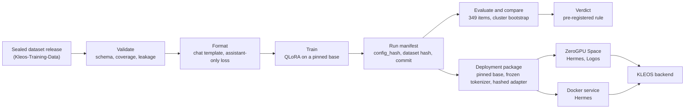

<div align="center">

<picture><source media="(prefers-color-scheme: dark)" srcset="docs/assets/kleos-mark-dark.svg"></picture>

# KLEOS Models

Behavioral fine-tuning and pre-registered evaluation of open-weight models for KLEOS, an AI operating system for computer science students

[](https://github.com/TejasNaik24/Kleos-Models/actions/workflows/ci.yml)
[](pyproject.toml)
[](LICENSE)
[](https://docs.astral.sh/ruff/)
[](https://mypy-lang.org/)
[](tests/)
[](docs/deployment.md)
[](#tech-stack)

</div>

## TL;DR

- **What:** the data contract, QLoRA training pipeline, pre-registered evaluation harness and serving stack behind two KLEOS models, both fine-tuned from Mistral AI open-weight bases.
- **Fine-tuning:** KLEOS Hermes (Mistral-Nemo 12B) raised the KLEOS policy score from 0.4755 (the same base with prompt-engineered orchestration) to 0.8051, with all 7 tasks improved (p < 0.001, 349 held-out items).
- **Head-to-head:** KLEOS Logos v0.0.2 (Ministral 3 14B Reasoning, trained to write a policy-derived reasoning trace before it answers) is measurably better than Hermes on the pre-registered answerable subset: +0.0409, cluster 95% CI +0.0040 to +0.0780.
- **Data:** every training example is synthetic, built by the companion pipeline [Kleos-Training-Data](https://github.com/TejasNaik24/Kleos-Training-Data); its releases are sealed, content-hashed and rebuild byte for byte.
- **Cost:** $0. Trained on free Colab and Kaggle T4 GPUs, served from free Hugging Face ZeroGPU Spaces.
- **Caveats:** one training seed per model, so training noise sits outside every interval; and every answer is prose, never JSON (`format_valid` 0.0 for every model).

Built by Tejas Naik.

## Contents

- [Overview](#overview)
- [Research question and design](#research-question-and-design)
- [Results](#results)
- [Models](#models)
- [How it works](#how-it-works)
- [Method](#method)
- [Tech stack](#tech-stack)
- [Quickstart](#quickstart)
- [Reproducing the results](#reproducing-the-results)
- [Limitations](#limitations)
- [Project structure](#project-structure)
- [Documentation](#documentation)
- [Contributing and security](#contributing-and-security)
- [Citation](#citation)
- [License](#license)
- [Related projects](#related-projects)
- [Acknowledgements](#acknowledgements)

## Overview

KLEOS is an AI operating system for computer science students, live at [kleos-cs.vercel.app](https://kleos-cs.vercel.app). Its models make judgment calls on the student's behalf: which notification matters, which context to surface, what to recommend, how to resolve two memories that disagree, which tool a request needs, how to reason across workspaces, what goes in a briefing, and when to decline for lack of evidence.

This repository holds everything on the model side of that system: the dataset contract and validators, the training pipeline, the evaluation harness, the experiment record, and the code that packages and serves a trained adapter. It does not hold the KLEOS application, the research dataset or any model weights. The dataset is built by the companion repository [Kleos-Training-Data](https://github.com/TejasNaik24/Kleos-Training-Data): every example is generated from a scenario with fictional entities and every answer is computed from an explicit decision policy, and each sealed release is consumed here as a directory path. The bundled examples in `data/examples/` are synthetic development fixtures. The public/private boundary is defined in [docs/privacy.md](docs/privacy.md).

## Research question and design

> Per subtask, can a behaviorally fine-tuned open-weight model outperform a prompt-engineered orchestration baseline on judgment and correctness metrics?

The models are trained to learn decision policies (prioritization, evidence-aware recommendation, relevance judgment, tool routing, briefing behavior). Facts about a particular student belong in retrieval and memory, and the dataset validators flag examples that teach a private fact.

| Arm | What it is | Run on the full benchmark |
| --- | --- | --- |
| `arm0_base` | Base model, standard prompting, no orchestration | No (a 20-example probe only) |
| `arm1_base_orchestrated` | Base model plus the KLEOS retrieval, context and prompt scaffolding | Ministral-8B, Hermes, Logos v0.0.1 |
| `arm2_finetuned` | Fine-tuned model with controlled task context | All four trained models |
| `arm3_finetuned_orchestrated` | Fine-tuned model plus orchestration | No |

Every hypothesis (H1 to H9) was written into [docs/experiments.md](docs/experiments.md) with its metric, population and decision rule before the run that tested it. Departures are logged as deviations D1 to D13 when they happen, superseded numbers stay beside their corrections, and negative and inconclusive results stay on the record. Status: H1 supported and replicated; H3 improved but still poor; H8a supported; H8b inconclusive; H9 better; H2 not measurable on this benchmark; H4 and H5 not run; H6 closed; H7 partially measured ([status table](docs/experiments.md#status)).

## Results

All scores are means of the composite `kleos_policy` grader (0 to 1, higher is better) on the same 349-item held-out benchmark (sha256 `a11ffad7…`), with greedy decoding and seed 42.

**Table A. Fine-tuning against the orchestrated baseline** (`arm1_base_orchestrated` vs `arm2_finetuned`, all 349 items)

| Run (date, hypothesis) | Base | Baseline | Fine-tuned | Δ | Tasks |
| --- | --- | ---: | ---: | ---: | --- |
| Ministral-8B (2026-09-15, H1) | `Ministral-8B-Instruct-2410` | 0.4744 | 0.8015 | +0.3271 | 7 of 7 improved at p < 0.05, none regressed |
| Hermes v0.0.6 (2026-09-22, H1 replication) | `Mistral-Nemo-Instruct-2407` | 0.4755 | 0.8051 | +0.3295 (95% CI 0.3068–0.3521) | 7 of 7 improved at p < 0.001, none regressed |
| Logos v0.0.1 (2026-10-01, H8a) | `Ministral-3-14B-Instruct-2512-BF16` | 0.4469 | 0.7896 | +0.3427; answerable +0.3952 (cluster 95% CI +0.3443 to +0.4438) | 5 of 7 improved by group intervals, none regressed |

- The first two rows use the example-level paired bootstrap pre-registered for H1. From H8 on, intervals resample the 78 groups of perturbed items ([protocol amendment, 2026-09-24](docs/experiments.md#protocol-amendment--clustered-intervals-2026-09-24)), which gives wider intervals: by examples, Logos v0.0.1 improved 6 of 7. H1's per-task verdicts were not re-computed by groups (finding H-F14, [Hermes run report](docs/experiments/kleos-v006-mistralnemo12b-run1-report.md#11-findings)); given the gap sizes clustering is unlikely to change them, but this has not been shown.
- The Ministral-8B baseline is the corrected score after the nDCG re-grade (finding F1, [artifact audit](docs/experiments/kleos-v006-ministral8b-run1-artifact-audit.md)); it was first reported as 0.5231 with 6 of 7 tasks significant, and the fine-tuned score did not change.
- H1 pre-registered `arm0_base` and an `entity_holdout` split. Every run compares against `arm1_base_orchestrated`, the baseline the research question names ([deviation D1](docs/experiments.md#deviations-log)), on the sealed release's `format_holdout` split (D2).

**Table B. Head-to-head against Hermes** (both `arm2_finetuned`; primary population: the 271 answerable items in 61 groups; paired cluster bootstrap by `group_id`, 2,000 resamples; equivalence margin ±0.02)

| Hypothesis (date) | Hermes | Logos | Logos − Hermes | Cluster 95% CI | Verdict |
| --- | ---: | ---: | ---: | --- | --- |
| H8b: Logos v0.0.1 vs Hermes (2026-09-29) | 0.8976 | 0.8808 | −0.0168 | −0.0546 to +0.0177 | inconclusive |
| H9: Logos v0.0.2 vs Hermes (2026-10-06) | 0.8976 | 0.9385 | +0.0409 | +0.0040 to +0.0780 (p = 0.031) | better |

Overall means over all 349 items, descriptive and not tested: Hermes 0.8051, Logos v0.0.1 0.7896, Logos v0.0.2 0.8596.

- **One training run per model.** The intervals cover evaluation noise, not training noise. H9's lower bound, +0.0040, is close to zero: the gain is measurable and its size is uncertain.
- **Three changes at once in H9.** The base model, the data (kleos-policy-v0.0.7, with reasoning traces) and the generation budget (1,024 against 512 new tokens) changed together, and Hermes was not retrained on v0.0.7, so H9 does not say which change produced the gain.
- **Prose answers.** `format_valid` is 0.0 for every model on all 349 items. The test split holds out the JSON format; the score measures the decision in prose answers and reports format separately (D2, D6).
- **Should-decline items.** The other 78 items expect four decline labels that never occur in v0.0.6 training (D3), which is why the answerable subset is primary. On them, H9's gain of +0.1020 is not significant by groups (CI −0.0018 to +0.2062).

Full numbers: [H9 result](docs/experiments.md#h9-result--2026-10-06), [H8b result](docs/experiments.md#h8b-result--2026-09-29), and the run reports indexed in [docs/experiments/README.md](docs/experiments/README.md).

## Models

| | Hermes v0.0.6 | Logos v0.0.2 (Beta) |
| --- | --- | --- |
| Role | The faster model | The deeper model; writes a reasoning trace before it answers |
| Base @ pinned revision | `mistralai/Mistral-Nemo-Instruct-2407` @ `04d8a905` | `mistralai/Ministral-3-14B-Reasoning-2512` @ `51f9210f`, text tower |
| Adapter sha256 | `dc121fa3…` (`checkpoint-200`) | `e49724f6…` (`checkpoint-175`) |
| Trained | 2026-09-17 to 2026-09-18, Colab T4 | 2026-10-06, Kaggle 2 × T4, 4.43 h |
| Served | Private ZeroGPU Space since 2026-09-23; Docker image built, not GPU-tested | Private ZeroGPU Space since 2026-10-07 |
| Reproduction check | 9 of 9 replies byte-identical to the frozen evaluation, on Colab T4 and on ZeroGPU | 8 of 9 identical (answer and trace); 1 diverged late in its trace on the Space's GPU and changed its decision |
| Model page | [docs/hermes.md](docs/hermes.md) | [docs/logos.md](docs/logos.md) |

Both adapters are served from private package repositories and are not published; full hashes and pins are in [`configs/deployment/`](configs/deployment/). Measured on ZeroGPU: Hermes generates about 12 tokens/s and spends 7–13 GPU seconds per call, roughly 20–30 answers a day per calling account (estimated from those calls); Logos generates 11.0 tokens/s warm and allows about 9 answers from a fresh daily window (estimated from 24–26 GPU seconds per answer and the rule that a call is admitted only while 90 s of the 300 s quota remain); 7 were admitted on day 1, when the window had already been partly used. Logos v0.0.1 and the Ministral-8B run are research records and are not served. Details: [verification status](docs/deployment.md#verification-status).

## How it works



- **Data** (`data/`): schema validation, coverage over variation axes, leakage detection (exact, normalized, MinHash near-duplicate, entity), split strategies, and chat formatting that masks the loss to assistant tokens.
- **Models** (`models/`): one adapter per Mistral architecture (`MistralDenseAdapter`, `Mistral3VLMAdapter`, `Ministral3TextAdapter`, `Ministral3ReasoningTextAdapter`), NF4 quantization, LoRA targets checked against the loaded modules, and per-GPU memory estimates.
- **Training** (`training/`): Hugging Face `Trainer` with PEFT, a gradient check and a memory probe on the longest batch before step 1, checkpoint validation and resume, and an event log that never records example text.
- **Evaluation and experiments** (`evaluation/`, `experiments/`): graders, consistency, faithfulness heuristics, paired and cluster bootstraps, offline re-scoring, resumable evaluation, and a manifest for every run, failed runs included.
- **Serving** (`serving/`, `inference/`): package verification, a FastAPI service, the ZeroGPU request path, a status contract and a reference client that returns a status instead of raising.

`config`, `data`, `experiments`, the scoring half of `evaluation` and the verification and client side of `serving` import without torch. `tests/test_import_isolation.py` enforces this, and CI runs the whole suite on Python 3.11 to 3.13 without torch, then once more with CPU torch. Details: [docs/architecture.md](docs/architecture.md).

## Method

| Setting | Value (identical across the KLEOS runs unless noted) |
| --- | --- |
| Quantization | 4-bit NF4, double quantization; fp16 compute on T4 |
| LoRA | r 16, α 32, dropout 0.05, all seven projections; 280 modules on Hermes and Logos |
| Trainable parameters | 57,016,320 (Hermes); 60,948,480 (Logos) |
| Loss | Assistant tokens only |
| Optimizer and schedule | `paged_adamw_8bit`, learning rate 2e-4, cosine, warmup ratio 0.03 |
| Length | 3 epochs, effective batch 8 (309 steps), `max_seq_length` 1024 |
| Checkpoint selection | Lowest validation loss (`eval_loss`) |
| Decoding | Greedy, seed 42; `max_new_tokens` 512 (Ministral-8B, Hermes, Logos v0.0.1) or 1,024 (Logos v0.0.2) |
| Thinking split | Logos v0.0.2 completions are split at `[/THINK]` (token 35); only the answer after it is graded |

**Benchmark.** 349 items built from the sealed test split by `scripts/build_benchmark.py`, covering seven tasks: 271 answerable and 78 should-decline. The split strategy is `format_holdout` (the JSON input format never appears in training). Test scenarios come from the same families as training; only the input format is held out, so the benchmark measures transfer across format, not to new scenarios (deviation D2). The items form 78 groups (`group_id`) of logically equivalent perturbations of one case. The `kleos_policy` grader scores ranking, deciding factor and confidence together and reports `format_valid` separately, outside the score. From H8 on, intervals come from a paired cluster bootstrap by `group_id` (2,000 resamples, 95%).

**Data.** kleos-policy-v0.0.6 has 820 training, 181 validation and 349 test examples. kleos-policy-v0.0.7 adds a policy-derived reasoning trace and a "What decided it" line to the training and validation answers, and trains the four decline labels that v0.0.6 lacks; its `test.jsonl` is byte-identical to v0.0.6's. Both releases are sealed and content-hashed (v0.0.6 `3cc9a744…`, v0.0.7 `b53afa42…`); the [Kleos-Training-Data](https://github.com/TejasNaik24/Kleos-Training-Data) pipeline rebuilds them byte for byte with `make slice`. Details: [docs/training.md](docs/training.md), [docs/evaluation.md](docs/evaluation.md), [docs/data-contract.md](docs/data-contract.md).

## Tech stack

    
    
  

| Layer | Tools | Versions |
| --- | --- | --- |
| Language | Python | 3.11, 3.12, 3.13 (CI matrix); 3.12 in the Spaces |
| Configuration and data | pydantic, PyYAML, jsonschema, NumPy | pydantic ≥ 2.7, < 3 |
| Training | PyTorch, Transformers, PEFT, Accelerate, bitsandbytes | Pinned for the runs and for serving: transformers 5.16.1, peft 0.20.0, accelerate 1.14.0, bitsandbytes 0.50.2; torch 2.11.0+cu128 for Hermes and in every serving image |
| Serving (Docker) | FastAPI, Uvicorn, CUDA 12.8.1 runtime image | fastapi 0.141.1, uvicorn 0.53.0 |
| Serving (ZeroGPU) | Gradio, `spaces` | gradio 6.28.0, spaces 0.51.3 |
| Quality | pytest, Ruff, mypy, GitHub Actions | 1,638 tests collected |
| Compute | Colab T4, Kaggle 2 × T4, Hugging Face ZeroGPU | Free tiers |

## Quickstart

Install one of three variants (Python 3.11 or newer):

```bash
git clone https://github.com/TejasNaik24/Kleos-Models.git && cd Kleos-Models
python3 -m venv .venv && source .venv/bin/activate
pip install -e ".[dev]"              # data, configuration and evaluation scoring; no torch
pip install -e ".[train,dev]"        # adds model loading and training (CPU or CUDA)
pip install -e ".[train,quant,dev]"  # adds 4-bit quantization (CUDA only)
```

The `serve` extra adds the FastAPI service. On Colab, `python scripts/colab_setup.py` installs the packages without reinstalling Colab's torch.

Check the pipeline without a GPU or a model:

```bash
make check                                                       # ruff, format check, mypy, pytest
python scripts/validate_dataset.py --dataset data/examples       # schema, coverage, leakage
python scripts/smoke_test.py                                     # imports, configs, data and evaluation pipelines
python scripts/plan_run.py --all-models --simulate-gpu t4-colab  # which models fit a free T4
python scripts/evaluate.py --config configs/training/qlora_small.yaml \
    --echo --arm arm0_base --output outputs/echo.json            # the harness end to end, echo backend
```

Numbers computed from `data/examples/` describe the pipeline, not KLEOS.

Train on Colab with [`notebooks/02_train_qlora.ipynb`](notebooks/02_train_qlora.ipynb) ([docs/colab.md](docs/colab.md)), on Kaggle's two GPUs with [`notebooks/kaggle`](notebooks/kaggle) ([docs/kaggle.md](docs/kaggle.md)), or on a local CUDA machine:

```bash
python scripts/plan_run.py --config configs/training/kleos_hermes_v006.yaml
python scripts/train.py --config configs/training/kleos_hermes_v006.yaml \
    --dataset <path to release> --experiment-id <experiment-id>
# after an interruption: the same command with --resume-from-checkpoint auto
```

Evaluate and compare:

```bash
python scripts/build_benchmark.py --dataset <path to release> --output <benchmark dir>
python scripts/evaluate.py --config configs/training/kleos_hermes_v006.yaml --arm arm2_finetuned \
    --adapter <private storage>/outputs/<experiment-id>/adapter \
    --benchmark <benchmark dir>/benchmark.jsonl --output arm2_finetuned.json --resume
python scripts/compare.py --base arm1_base_orchestrated.json --finetuned arm2_finetuned.json \
    --report reports/<experiment-id>
python scripts/compare.py --cross-model --base hermes_arm2.json --finetuned logos_arm2.json \
    --primary-subset answerable --equivalence-margin 0.02
```

## Reproducing the results

- **Anyone** can run the 1,638 tests, run the harness on the fixtures, and check that the training configs still resolve to the recorded `config_hash` values (`tests/test_logos_config.py` and `tests/test_logos_v002_config.py` pin Hermes, Logos v0.0.1 and Logos v0.0.2). The run reports record the hash chain from the benchmark file to each results file, adapter and deployment package.
- **Anyone who rebuilds a release** with the companion pipeline ([Kleos-Training-Data](https://github.com/TejasNaik24/Kleos-Training-Data), `make slice-clean slice`, which reproduces v0.0.7's content hash `b53afa42…`) can retrain and re-evaluate with the runbooks: [Logos v0.0.1 on Colab](docs/runbooks/logos-v001-colab.md), [Logos v0.0.2 on Kaggle](docs/runbooks/logos-v002-kaggle.md), and deployment to ZeroGPU for [Hermes](docs/runbooks/deploy-hermes-zerogpu.md) and [Logos](docs/runbooks/deploy-logos-zerogpu.md).
- **The trained adapters are not published**, so the exact served weights cannot be re-derived without retraining; a retrained adapter is a new run with its own seed noise, not a bit-for-bit copy.

Every run writes a manifest with the experiment id, `config_hash`, seed, dataset version and hash, split strategy, model and revision, LoRA and quantization settings, hardware, library versions, git commit and dirty flag, checkpoints, metrics and status. Failed runs are recorded as `status: failed`. Automatic configuration changes go into `adjustments[]`, and `training.strict_config: true` turns any of them into an error.

```
<private storage>/outputs/<experiment-id>/
  adapter/  tokenizer/  config.yaml  manifest.json  metrics.json
  events.jsonl  environment.txt  README.md  checkpoint-*/
```

The first run (Ministral-8B) used `revision: main`, and the commit it resolved to is not recoverable (D7). Every later run and deployment pins its base commit.

## Limitations

- **One seed per model.** No interval includes training noise, and H9's lower bound (+0.0040) is close to zero.
- **H9 is confounded.** The base, the data and the generation budget (1,024 against 512 new tokens) changed together; Hermes was not retrained on v0.0.7.
- **Policy-derived traces.** The reasoning traces are generated from the same policies that define the benchmark's reference answers, so H9 measures how well a model learns those policies, not general reasoning.
- **Prose, never JSON.** `format_valid` is 0.0 for every model; a consumer that needs structured output must parse prose.
- **Abstention.** On v0.0.6, 22% of the test items expect decline labels absent from training (D3), and Ministral-8B and Hermes declined by scenario family rather than by evidence (H3). v0.0.7 trains those labels; H9's should-decline gain is not significant by groups. Whether Logos v0.0.2 declines by evidence rather than by scenario family (the shortcut found in H3 for Hermes) was not analyzed.
- **Consistency.** Hermes changes its decision within 10 of 15 scenario families under logically irrelevant perturbations (correct agreement 0.333), though 6 of the 15 mix cases whose correct answers differ (finding H-F11, [Hermes run report](docs/experiments/kleos-v006-mistralnemo12b-run1-report.md#11-findings)). By `group_id`, against an oracle of 1.000, Hermes scores 0.769 and Logos v0.0.2 0.833.
- **Serving GPU differs from evaluation GPU.** Evaluations ran on T4s; the Spaces run on an RTX PRO 6000 Blackwell slice. Hermes matched 9 of 9; Logos matched 8 of 9, and its live outputs are not re-measured.
- **Not measured.** H2 (the out-of-distribution gap) is not measurable on a benchmark that is out of distribution by format throughout; H4 (general capability) and H5 (scale) were not run; `arm0_base` and `arm3_finetuned_orchestrated` were not run on the full benchmark, so H7 is half-measured.
- **Coarse heuristics.** Faithfulness and citation checks are text-level heuristics, not entailment checks.
- **Untuned hyperparameters.** The recipe uses engineering defaults.
- **The 24B config is untested.** `mistral_small_3_2.yaml` is a vision-language adapter example that was never trained; its LoRA scoping fails on transformers 5 (finding L-F1, [Logos findings](docs/experiments/logos-findings.md)), held as strict xfails.

## Project structure

```
Kleos-Models/
├── .github/workflows/    CI: private-data scan, lint, types, tests with and without torch, configs, smoke test
├── configs/              layered YAML: base, models (5), datasets, training, evaluation, deployment
├── data/
│   ├── schema/           JSON Schema for the data contract (generated)
│   └── examples/         synthetic development fixtures, not research data
├── deploy/
│   ├── zerogpu-space/        Hermes ZeroGPU Space: app, pinned requirements, card
│   └── zerogpu-space-logos/  Logos ZeroGPU Space
├── docker/               Hermes serving image, compose file, environment example
├── docs/
│   ├── assets/           the KLEOS mark
│   ├── datasets/         dataset repair specification
│   ├── experiments/      frozen run reports, artifact audit, findings, serving records
│   └── runbooks/         training and deployment procedures
├── notebooks/            Colab notebooks; kaggle/ holds the Kaggle notebooks (Logos v0.0.2 and the output probe); all generated
├── outputs/              local run outputs, git-ignored except a tracked .gitkeep
├── scripts/              29 command-line entry points
├── src/kleos_models/
│   ├── config.py         typed, layered configuration and config_hash
│   ├── compat.py         transformers 4.56 to 5.x compatibility
│   ├── data/             schemas, validation, formatting, splitting, leakage, coverage
│   ├── models/           family adapters, loading, quantization, PEFT, feasibility
│   ├── training/         QLoRA trainer, callbacks, checkpointing, memory probe
│   ├── evaluation/       graders, metrics, consistency, faithfulness, corrections, resume, reports
│   ├── inference/        generation backends: Hugging Face, echo, frontier interface
│   ├── experiments/      manifests, registry, environment capture
│   └── serving/          package manifest, loader, FastAPI app, ZeroGPU path, status, client
├── tests/                1,638 tests, no GPU required
└── README.md, CHANGELOG.md, CONTRIBUTING.md, SECURITY.md, LICENSE, CITATION.cff,
    pyproject.toml, requirements.txt, Makefile, .env.example
```

## Documentation

| Page | Contents |
| --- | --- |
| [docs/README.md](docs/README.md) | Index of every page, by reader path |
| [docs/hermes.md](docs/hermes.md) | KLEOS Hermes: base, recipe, H1 result, serving status |
| [docs/logos.md](docs/logos.md) | KLEOS Logos: v0.0.1 and v0.0.2, H8 and H9, serving |
| [docs/experiments.md](docs/experiments.md) | Pre-registered hypotheses, results log, deviations |
| [docs/architecture.md](docs/architecture.md) | Layers, adapters, configuration, serving |
| [docs/training.md](docs/training.md) | QLoRA pipeline, memory, two GPUs, resume |
| [docs/evaluation.md](docs/evaluation.md) | Graders, metrics, consistency, intervals |
| [docs/deployment.md](docs/deployment.md) | Packages, pinning, serving profiles, hosts |
| [docs/serving-api.md](docs/serving-api.md) | Request, reply and status contract for the KLEOS backend |

## Contributing and security

Contributions are welcome; [CONTRIBUTING.md](CONTRIBUTING.md) covers setup, `make check`, the design constraints, and how to add a model family or a grader. Report a vulnerability or an accidental data exposure privately, as described in [SECURITY.md](SECURITY.md), never in a public issue. The private-data scanner (`scripts/check_no_private_data.py`) runs as the first CI job.

## Citation

If you use this software or its results, please cite it ([`CITATION.cff`](CITATION.cff) has the same metadata):

```bibtex
@software{naik2026kleosmodels,
  author  = {Naik, Tejas},
  title   = {{KLEOS Models}: Behavioral Fine-Tuning and Pre-Registered Evaluation of
             Open-Weight Models for a Student {AI} Operating System},
  year    = {2026},
  version = {0.4.0},
  url     = {https://github.com/TejasNaik24/Kleos-Models},
  license = {MIT}
}
```

## License

The code is MIT-licensed ([LICENSE](LICENSE)), and so are the synthetic fixtures in `data/examples/`. Base models carry their own licenses, and an adapter is generally subject to its base model's terms.

| Base model | Used for | License |
| --- | --- | --- |
| `mistralai/Mistral-Nemo-Instruct-2407` | Hermes | Apache-2.0 |
| `mistralai/Ministral-3-14B-Instruct-2512-BF16`, `mistralai/Ministral-3-14B-Reasoning-2512` | Logos v0.0.1, Logos v0.0.2 | Apache-2.0 |
| `mistralai/Ministral-8B-Instruct-2410` | The first research run | Mistral AI Research License (non-commercial, gated) |
| `mistralai/Mistral-Small-3.2-24B-Instruct-2506` | A config only; never trained | Apache-2.0 |

Redistributing a derivative of an Apache-2.0 base requires attribution and a statement of modification.

## Related projects

- [Kleos-Training-Data](https://github.com/TejasNaik24/Kleos-Training-Data): the pipeline that generates, screens and seals the synthetic datasets these models are trained and evaluated on.
- [KLEOS](https://kleos-cs.vercel.app): the AI operating system for computer science students that Hermes and Logos serve.

## Acknowledgements

I am grateful to Mistral AI for releasing the open-weight models every KLEOS adapter is built on; to Hugging Face for Transformers, PEFT, Accelerate, the Hub and the free ZeroGPU hardware that serves both models; to the bitsandbytes maintainers for the 4-bit quantization that makes QLoRA fit a 16 GB GPU; and to Google Colab and Kaggle for the free GPUs that trained and evaluated every run.
