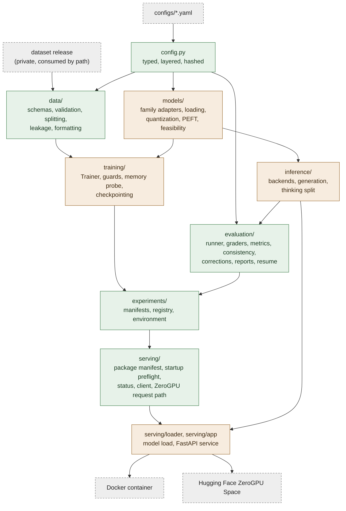

# Architecture

## What the code is for

KLEOS Models exists to answer one question:

> Per subtask, can a behaviorally fine-tuned open-weight model outperform a
> prompt-engineered orchestration baseline on judgment and correctness metrics?

The answer is empirical and could be negative, so the design aims at results that
can be checked: identical conditions across arms, per-example records, every
adjustment and failure written down, and hypotheses registered before the runs
that test them. The record of those runs, with the conventions for finding and
decision ids, is indexed in [experiments/README.md](experiments/README.md).

## Layers



Green modules never import torch at module scope; amber modules import it inside
functions; grey dashed nodes are outside the package. The scripts in `scripts/`
are thin command-line wrappers over these layers.

## The dependency-isolation rule

`config`, `compat`, `publishing`, `data`, `evaluation`, `experiments` and the
serving modules that verify a package or call a running service never import
torch, transformers, peft, bitsandbytes, accelerate or datasets at module scope.

What that buys:

- Dataset preparation, validation, leakage checks and re-scoring run on any
  laptop, with a dependency install measured in seconds.
- CI runs the full logic suite without a GPU image.
- A notebook prints a feasibility table for every model before installing or
  downloading anything heavy.
- A stored result can be re-analyzed months later without rebuilding a training
  environment.
- A deployment package is verified, and a bad one refused, before the base
  weights are downloaded.

`models/`, `training/`, `inference/`, `serving/loader.py` and `serving/app.py`
need torch, and import it inside functions, so even they are importable for
introspection and planning.

`tests/test_import_isolation.py` enforces the rule. It blocks the heavy packages
both through `builtins.__import__` and through a `sys.meta_path` finder, then
imports every listed module afresh. Breaking the rule is a test failure.

## Configuration

Layered YAML with `extends` (defaults) and `includes` (section fragments), so a
training config consumes a model config unmodified:

```yaml
extends: ../base.yaml
includes:
  model: ../models/mistral_nemo_12b.yaml
  dataset: ../datasets/kleos_policy_v006.yaml
  evaluation: ../evaluation/kleos_policy_v006.yaml
```

Resolution order: `extends`, then `includes`, then the file's own keys, then
`--set` overrides. Unknown keys are rejected, so a typo fails loudly. Strings may
read the environment with `${env:NAME:default}`.

`ExperimentConfig.config_hash` is a sha256 over the fully resolved config,
including the dataset path and output directory. Two runs with the same hash
used the same settings, which makes "same config, different seed" checkable.
H8 and H9 recorded their config hashes before training, and the Kaggle training
notebook refuses to train unless the hash matches the registered one. Because
the resolved values are hashed, a `KLEOS_*` variable that changes a path also
changes the hash.

Fields added after runs were recorded default to `None` and are listed in
`HASH_NEUTRAL_FIELDS`, which omits them from the dump while unset. Earlier
config hashes therefore still reproduce. `fix_mistral_regex` is one.

## The model-family adapter layer

Everything that differs between checkpoints lives behind `ModelFamilyAdapter`.
The training and evaluation pipelines never branch on model family, so a
comparison between two bases measures the models rather than the harness.

`get_adapter` looks up `model.model_type` in `ADAPTER_REGISTRY`;
`register_adapter` adds a family. When the downloaded `config.json` reports a
different `model_type`, the checkpoint is trusted, except for a deliberate
single-tower view (the two Ministral 3 adapters below).

| Concern | Why it is per family |
| --- | --- |
| Auto class | `AutoModelForCausalLM` for text models, `AutoModelForImageTextToText` for a vision-language container |
| LoRA targets and scope | the seven attention and MLP projections; `language_model.*` only for `mistral3` |
| Exclusions | `lm_head` and `embed_tokens` always; vision tower and projector on vision-language checkpoints |
| Reasoning capability | `unsupported` or `always_on` |
| Quantization exceptions | never quantize `lm_head` or an unused vision tower |
| Checkpoint view | load one tower of a multi-tower checkpoint, and prove nothing else loaded |

### The four adapters

| Adapter | `model_type` | Configs | What it encodes |
| --- | --- | --- | --- |
| `MistralDenseAdapter` | `mistral`, `ministral` | `mistral_nemo_12b` (Hermes), `ministral_8b` | A plain causal LM with no reasoning mode. |
| `Mistral3VLMAdapter` | `mistral3` | `mistral_small_3_2` | A vision-language model: `AutoModelForImageTextToText`, LoRA scoped to the language tower, vision tower and projector frozen and unquantized. |
| `Ministral3TextAdapter` | `ministral3` | `ministral3_14b` (Logos v0.0.1) | The text tower of a Ministral 3 container, loaded as `Ministral3ForCausalLM`. |
| `Ministral3ReasoningTextAdapter` | `ministral3_reasoning` | `ministral3_14b_reasoning` (Logos v0.0.2) | The same view, with a thinking-only capability. |

### Facts the adapters encode

**Mistral Small 3.2 is a vision-language model.** Its config declares
`Mistral3ForConditionalGeneration` (`model_type: mistral3`), and transformers
registers `mistral3` only in `MODEL_FOR_IMAGE_TEXT_TO_TEXT_MAPPING_NAMES`, so
`AutoModelForCausalLM.from_pretrained` fails on it. The config exists as an
example of the vision-language path and was never trained. Its LoRA scoping does
not work on transformers 5 (finding L-F1, recorded in
[experiments/logos-findings.md](experiments/logos-findings.md)), and
`tests/test_vlm_targeting_finding.py` holds that as strict expected failures.

**A Ministral 3 checkpoint is a vision-language container whose text tower is
`ministral3`.** KLEOS data is text-only, and the 0.44B-parameter vision tower
would cost about 0.9 GB on a T4 with less than 1 GB to spare. The text-only view
instantiates `Ministral3ForCausalLM` from the official checkpoint with its keys
renamed (`language_model.model.*` to `model.*`, `language_model.lm_head.*` to
`lm_head.*`) and leaves the vision weights on disk. It refuses a container whose
tower is not `ministral3`, a pre-quantized container (the FP8 release, which a
T4 cannot run, hence the `-BF16` repository for the Instruct model), and any load
that leaves a text weight missing or brings a vision parameter in.

**Ministral 3 Reasoning always thinks.** Its completions are
`[THINK]trace[/THINK]answer`, and its adapter refuses `standard` mode.

## Reasoning as a capability

Reasoning is a declared property of a checkpoint, validated against what a run
requests (`src/kleos_models/config.py`):

- `ReasoningCapability` is `UNSUPPORTED` (Mistral-Nemo, Ministral-8B, Ministral 3
  Instruct, Mistral Small 3.2) or `ALWAYS_ON` (Ministral 3 Reasoning).
- `ReasoningMode` is `STANDARD` or `THINKING`.
- `resolve_reasoning_mode` refuses `thinking` on a model without a reasoning mode
  and `standard` on a thinking-only model, with an explanation in each case.

The pipeline never injects `<think>` strings to simulate reasoning: that would
measure formatting compliance, not reasoning.

Training targets carry no reasoning, with one exception:

- **By default** (`model.reasoning.strip_thinking_from_targets: true`) any
  reasoning is removed from the targets before tokenizing, and the number of
  affected examples is recorded as `reasoning_dropped`.
- **A model trained to think** sets it to `false`. Logos v0.0.2 is the only one:
  the policy-derived `reasoning` field of kleos-policy-v0.0.7 reaches the chat
  template as the thinking span, and the whole of `[THINK]trace[/THINK]answer` is
  supervised. Such a run refuses to start if truncation would cut any supervised
  token.

At evaluation the completion is split at the `[/THINK]` token before decoding, so
graders read only the answer; the trace is stored beside it (results schema 3).
Reasoning in prior assistant turns is removed from multi-turn history by default
(`strip_thinking_from_history`).

## Feasibility planning

`models/feasibility.py` estimates peak VRAM from the model's shape (read from
`config.json` at the pinned revision), quantization, LoRA rank and targets,
optimizer, activations and logits. It is arithmetic, needs no GPU, and is checked
against measured peaks of earlier runs (`EMPIRICAL_ANCHORS`). It emits a tier:

`infeasible` < `inference_only` < `smoke` < `adapter_train` < `full_research`

With `device_map: auto` and more than one GPU it estimates each GPU and gates on
the fuller one. `--simulate-gpu NAME:GIB:CC:COUNT` plans for hardware not present.

Adjustments are proposed and recorded, never silently applied.
`training.strict_config: true` turns any required adjustment into a hard error,
so a memory-driven fallback cannot quietly change a pre-registered comparison.
The estimate is not the last word: the memory probe measures the longest batch
before step 1. [training.md](training.md#memory) has the details.

## Training

The Hugging Face `Trainer` plus PEFT, without trl, whose 1.x API churn would add a
moving dependency to the most consequential code for no gain here.

Three silent failures are guarded:

1. **Targets that match nothing**: validated against the loaded model's real
   `named_modules()`, with candidates listed on failure.
2. **An adapter that trains nothing**: a forward and backward pass before the
   real loop asserts that LoRA parameters receive non-zero gradients.
3. **A quiet full fine-tune**: refused when more than half the parameters are
   trainable, unless `training.allow_full_finetune` is set.

Assistant-only loss masking is computed by incremental chat-template application:
render up to a turn with a generation prompt, render through it, and take the
token range between. It asks the template where the boundary is instead of
guessing from a delimiter, so it works across families.

## Evaluation

The runner takes the research arm as a parameter and changes nothing else (same
benchmark, decoding, graders and seeds), so `arm1_base_orchestrated` and
`arm2_finetuned` differ only by the adapter and the orchestration prompt.

Per-example records are always kept, so any aggregate can be recomputed and
checked. In-distribution, OOD, consistency and capability results are reported
separately; there is no blended score unless one is requested. Benchmark identity
is checked by content, not by path. [evaluation.md](evaluation.md) covers graders,
corrected measures, cluster intervals and resume.

## Experiments

Every run writes a manifest tying the artifact to model, base revision, dataset
version and hash, config hash, seed, git commit and environment, plus every
adjustment, the formatting statistics, the memory probe and, on several GPUs,
where each part of the model landed. Failed runs write one too, with
`status: "failed"` and the failing stage.

The registry lists failures beside successes, so reporting a favorable subset
cannot happen by omission.

## Serving

Training output is a research artifact and is never edited. Serving uses a
**deployment package** built from it by `scripts/build_deployment_package.py`: the
adapter (with its own `adapter_config.json` carrying the pinned base revision),
the frozen tokenizer files, the packaged model config and a manifest of hashes.
`verify_deployment_package.py` checks it, and the service refuses to start if
the base revision, tokenizer or adapter differs from the deployment record in
`configs/deployment/`.

One serving codebase serves both models. A deployment record's `serving` block
(`src/kleos_models/serving/profile.py`) sets the per-model names and options:
secret prefix, key header, token budget and reply contract. Two hosts are
supported:

- **A Docker container** running the FastAPI service (`serving/app.py`), for
  Hermes v0.0.6.
- **A private Hugging Face ZeroGPU Space** per model (`deploy/zerogpu-space`,
  `deploy/zerogpu-space-logos`), where Hermes v0.0.6 is live and verified 9 of 9
  answers identical, and Logos v0.0.2 is live as a Beta with 8 of 9 identical.

Packages are uploaded to private repositories by
`scripts/upload_deployment_package.py`. [deployment.md](deployment.md) is the
reference for packages, profiles and hosts, and [serving-api.md](serving-api.md)
documents the request and reply contract.

## Boundaries

- **No Supabase.** Training consumes exported, versioned dataset artifacts. The
  research pipeline never touches production infrastructure.
- **No dependency on [Kleos-Training-Data](https://github.com/TejasNaik24/Kleos-Training-Data).** It produces a directory; this
  code consumes a path.
- **No automatic publishing.** Uploading requires an explicit command and passes
  an allowlist plus a content scan ([publishing.md](publishing.md)).
- **No user data.** The public/private rule is stated once, in
  [privacy.md](privacy.md).

## Further reading

| Document | Contents |
| --- | --- |
| [data-contract.md](data-contract.md) | Schema, variation axes, policy not facts |
| [training.md](training.md) | Recipe, QLoRA, guards, memory, two GPUs, checkpointing |
| [evaluation.md](evaluation.md) | Arms, graders, corrected measures, comparison, resume |
| [experiments.md](experiments.md) | Pre-registered hypotheses and results |
| [colab.md](colab.md), [kaggle.md](kaggle.md) | Running on the free GPU platforms |
| [deployment.md](deployment.md) | Deployment packages, serving profiles, hosts |
| [serving-api.md](serving-api.md) | The inference API contract for KLEOS |
| [privacy.md](privacy.md) | The public/private boundary |
| [troubleshooting.md](troubleshooting.md) | Known errors and their fixes |
